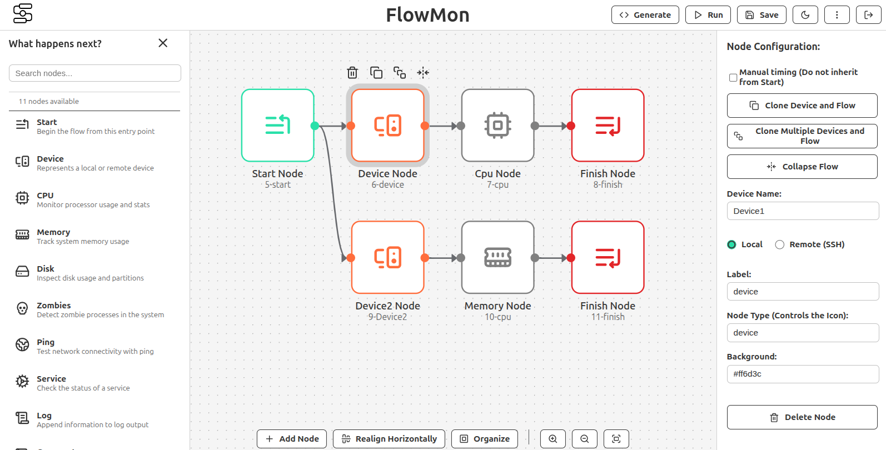

# FlowMon

**FlowMon is a visual workflow editor, built for the web. Create, run, and monitor tasks and shell scripts on multiple local or remote devices with a drag-and-drop interface.**

[](https://react.dev/)
[](https://nodejs.org/)
[](https://reactflow.dev/)

## About the Project

FlowMon transforms the complexity of system automation and scripting into a visual and interactive experience. The platform allows users, from system administrators to developers, to design complex execution flows by connecting functional nodes on a canvas. The system then automatically generates the corresponding shell scripts, which can be executed and monitored in real-time directly from the interface.

This project was designed to be a complete solution, covering everything from user authentication and project management to secure remote execution via SSH and performance metrics visualization.



## Prerequisites

- **Operating System**: Linux (recommended Ubuntu 24.04.2 LTS or Linux Mint 22.1)
- **Node.js**: v22.17.1
- **npm**: v11.4.2
- **Docker**: v28.3.2

## Installation and Configuration

### 1. Clone the repository

```bash
git clone https://github.com/eduardolima1994/flow.git
cd flow
```

### 2. Backend Configuration

#### Install dependencies
```bash
cd backend
npm i
```

#### Configure the .env file
Create a `.env` file in the `backend` directory with the following settings:

```env
JWT_SECRET=your_secret_key_here
DB_HOST=localhost 
DB_USER=flowmon_user
DB_PASSWORD=flowmon_password
DB_NAME=flowmon_db
DB_PORT=5432
```

#### Initialize the database
```bash
# Start the PostgreSQL container
docker compose up -d db

# Configure Sequelize (if necessary)
npx sequelize-cli init
```

#### Run the backend
```bash
node server.js
```

### 3. Frontend Configuration

#### Install dependencies
```bash
cd ../frontend
npm i
```

#### Install serve globally
```bash
npm install -g serve 
```

#### Run the frontend
```bash
serve -s ./ -p 3000
```

## Accessing the Application

1. Access the application at: [http://localhost:3000/](http://localhost:3000/)
2. Navigate to `/login`
3. Log in with one of the default users:

| User | Password |
|---------|-------|
| `admin` | `admin_password` |
| `user` | `user_password` |

## Main Features

- **Drag-and-Drop Visual Editor**: Create complex workflows intuitively using a vast library of predefined nodes (`CPU`, `Memory`, `Disk`, `Ping`, `Services`, and more).
- **Real-Time Script Generation**: Convert your visual diagrams into executable shell scripts (`.sh`) with a single click.
- **Remote Execution (SSH)**: Configure and run tasks on multiple remote devices securely, with password authentication support.
- **Terminal and Live Monitoring**: Track the `stdout`/`stderr` output of your executions and visualize performance graphs (CPU, Memory, etc.) in real time.
- **Project Management**: Complete user authentication system to save, load, list, and delete projects, ensuring your work is always secure and organized.
- **Advanced Workflow Features**:
  - **Device Cloning**: Clone a device and all its associated execution flow.
  - **Bulk Cloning**: Import a `.csv` file to clone a flow for dozens or hundreds of devices at once.
  - **Collapse/Expand Flows**: Keep your screen organized by hiding parts of the flow that are not in focus.
- **Import and Export**:
  - **Projects**: Export and import your complete workflows in `.json` format for backup or sharing.
  - **UML Diagrams**: Export a visual representation of your flow as a `.png` image using PlantUML.